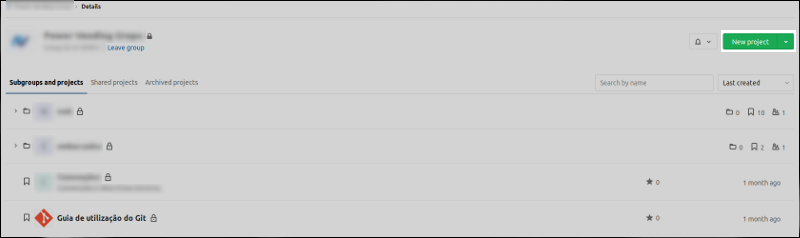
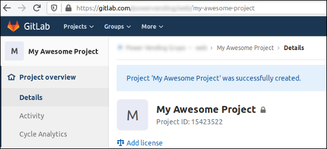

# 2. Criando um repositório

Partindo da tela inicial do Grupo localizamos o botão `New Project` no canto superior direito (Fig. 1) e clicamos nele. É possível criar um novo projeto a partir de várias telas dentro do Grupo e em todas o botão fica na mesma posição.

<figure>
	
	<figcaption>Figura 1 - Localização do botão `New Project`.</figcaption>
</figure>

Você será redirecionado para a tela de "Criação de um novo projeto" (Fig. 2) e todas as ações necessárias serão feitas na aba `Blank project`. Ao definir o nome do projeto seu _slug_ é preenchido automáticamente, porém, essa informação pode ser alterada de acordo com o que você preferir. É possível definir se seu projeto ficará alocado em algum subgrupo (`web` e `embarcados`, por exemplo) e sempre que possível escreva uma descrição sucinta sobre o projeto.
Você **deve** se certificar que o projeto é privado, por padrão esse checkbox não pode ser desmarcado, mas é sempre bom dar uma olhada nisso. Após preencher os campos necessários clique em `Create poject`.

<figure>
	
	<figcaption>Figura 2 - Tela de criação de um novo projeto.</figcaption>
</figure>

Você será redirecionado para a página inicial do projeto, a partir dai basta seguir as instruções presentes nesta página.

<figure>
	
	<figcaption>Figura 3 - Tela inicial do repositório.</figcaption>
</figure>
