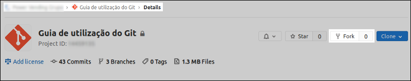
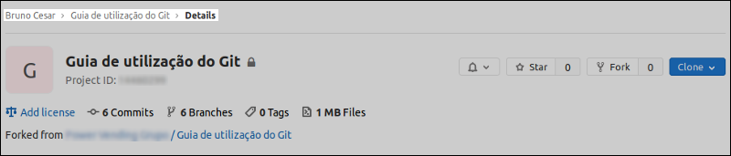
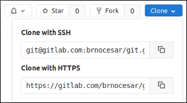

# 3. Clonando um repositório<a name='cap3'></a>

### <a href='#secao3.1'>3.1. Repositório do Grupo</a>
### <a href='#secao3.2'>3.2. _Fork_</a>
### <a href='#secao3.2.1'>3.2.1. Configurando os _remotes_</a>
### <a href='#secao3.2.2'>3.2.2. Atualizando o repositório local em relação ao remoto</a>

## 3.1. Repositório do Grupo<a name='secao3.1'></a>
Se você for trabalhar no repositório do Grupo da PV (que é o recomendável) basta realizar o clone do repositório:
```sh
$ git clone git@gitlab.com:powervending/subgrupo/projeto.git
```
Após isso você deve atualizar a branch _develop_ do seu repositório local para garantir que irá trabalhar na versão mais atual do código. Isso pode ser feito com os comandos abaixo:
```sh
repositorio$ git fetch --all
repositorio$ git pull origin develop
```
Note que você deve realizar o procedimento de atualização do projeto sempre que for iniciar o trabalho.

## 3.2. _Fork_<a name='secao3.2'></a>
Vamos abordar o procedimento para realizar o _fork_ de um repositório. Em termos práticos, fazer o _fork_ de um repositório significa que estamos criando uma cópia deste repositório em sua conta. Isso nos permite realizar alterações no repositório "copiado" sem que tais alterações se reflitam no original. 

O primeiro passo é acessar o repositório a ser forkado e clicar no botão 'Fork' (Fig. 1), selecione a conta para a qual será feito o _fork_ e aguarde. Após o fork ser realizado a página será redirecionada para o repositório  criado em sua conta (Fig. 2).

<figure>
	
	<figcaption>Figura 1 - Faça um fork do repositório no grupo da Power Vending.</figcaption>
</figure>

<figure>
	
	<figcaption>Figura 2 - Repositório copiado para sua conta no GitLab.</figcaption>
</figure>

Agora seguimos para a etapa em que será feito o clone deste repositório para sua máquina de trabalho. Defina o diretório em que seus repositórios ficarão armazenados, vá até ele e execute o comando:

```sh
$ git clone git@gitlab.com:username/git.git
```

A url `git@gitlab.com:username/git.git` é encontrada no _dropdown_ no botão 'Clone' (Fig. 3). A comunicação pode ser feita através do protocolo https, mas eu recomendo que seja feita pelo ssh para que não seja necessário digitar senha e usuário do git a cada commit.

<figure>
	
	<figcaption>Figura 3 - Opções de protocolo para clonar repositórios.</figcaption>
</figure>

### 3.2.1. Configurando os _remotes_<a name='secao3.2.1'></a>

Quando clonamos um repositório, automaticamente é criado um _alias_ chamado `origin` que aponta para o repositório remoto em sua conta. Rodando o comando `$ git remote -v` podemos verificar que há apenas este _remote_ configurado.

```sh
$ git remote -v
origin	git@gitlab.com:brnocesar/git.git (fetch)
origin	git@gitlab.com:brnocesar/git.git (push)
```

Precisamos adicionar um _remote_ para o repositório original (no grupo da Power Vending). Com o comando abaixo adicionamos um _remote_ chamado `upstream`, a escolha desse nome ocorre devido a convenção:

```sh
$ git remote add upstream git@gitlab.com:powervending/git.git
```

Se executar o comando `$ git remote -v` novamente irá verificar que agora temos dois _remotes_ configurados.

Além disso, se quiser alterar o nome do seu _remote_ de 'origin' para 'batatinha', por exemplo, basta executar o comando abaixo:

```sh
$ git remote rename origin batatinha
```

### 3.2.2. Atualizando o repositório local em relação ao remoto<a name='secao3.2.2'></a>
Sempre antes de iniciar seu trabalho você deve atualizar seu repositório local em relação ao `upstream`, para se certificar que está trabalhando com a versão mais recente. Mude para a branch _develop_ e rode os comandos abaixo:

```sh
$ git checkout master 
Switched to branch 'master'
$ git fetch --all
Fetching origin
Fetching upstream
$ git merge upstream/master 
Updating 0e2b5d4..763fd9e
Fast-forward
 README.md | 56 ++++++++++++++++++++++++++++++++++++++++++++++++++++++++
 1 file changed, 56 insertions(+)
```

O comando `$ git fetch --all` atualiza as referências locais em relação às remotas. Mas note que este comando não incorpora as atualizações ao seu repositório local, para isso, você pode realizar o _merge_ ou um _pull_.

Para "mergear" estas alterações você deve executar o comando `$ git merge <nome do remote>/<nome da branch>`, passando o _remote_ e _branch_ do qual as atualizações serão puxadas.

**Obs.:** Note que o exemplo acima usa a branch `master`, porém, você **NUNCA** irá atualizar seu repositório local de acordo a _master_ pois esta é a versão de produção. Você deve fazer a atualização em relação a `develop`, que é a versão de desenvolvimento.
