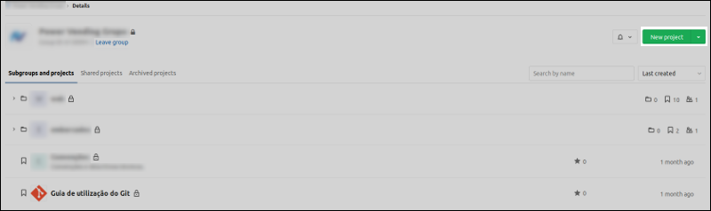
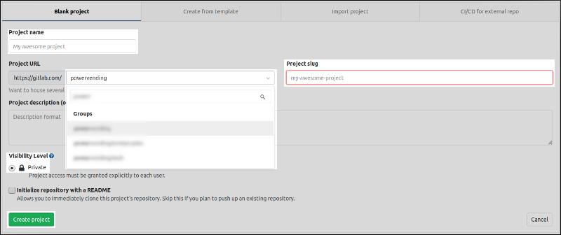
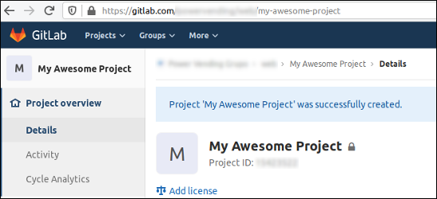
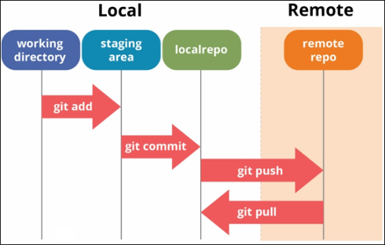

# Capítulo 3 - Trabalhando com o Remoto

1. [Projeto no GitLab](#1-projeto-no-gitlab)  
2. [Clonando um repositório](#2-clonando-um-repositório)  
3. [Sincronizando os dados](#3-sincronizando-os-dados)  

## 1 Projeto no GitLab

Partindo da tela inicial do Grupo localizamos o botão `New Project` no canto superior direito (Figura 1) e clicamos nele. É possível criar um novo projeto a partir de várias telas dentro do Grupo e em todas o botão fica na mesma posição.

<figure>
	
	<figcaption>Figura 1 - Destaque para o botão `New Project`.</figcaption>
</figure>

Você será redirecionado para a tela de "Criação de um novo projeto" (Fig. 2) e todas as ações necessárias serão feitas na aba `Blank project`. Ao definir o nome do projeto seu _slug_ é preenchido automáticamente, mas é editável. Também é possível definir se o projeto ficará alocado em algum subgrupo e escrever uma breve descrição.

Você **deve** se certificar que o projeto é privado, por padrão esse checkbox não pode ser desmarcado, mas é sempre bom dar uma olhada nisso. Após preencher os campos necessários clique em `Create poject`.

<figure>
	
	<figcaption>Figura 2 - Tela de criação de um novo projeto.</figcaption>
</figure>

Por fim você será redirecionado para a página inicial do projeto e a partir dai basta seguir as instruções presentes nesta página.

<figure>
	
	<figcaption>Figura 3 - Tela inicial do repositório.</figcaption>
</figure>

## 2 Clonando um repositório

A forma mais simples de iniciar a contribuição em um projeto é fazendo o clone do seu repositório. Isso é basicamente "trazer" uma cópia do repositório na nuvem para sua máquina. Basta copiar a URL do repositório no protecolo que preferir e rodar o comando abaixo:

```terminal
git clone <url do repositório> [nome do diretório local]
```

Caso sua escolha seja pelo protocolo SSH, certifique-se de já ter adicionado sua chave SSH pública à conta do serviço Git. Se optar pelo protocolo HTTP será necessário informar suas credências em todas as comunicações do repositório local com o remoto.

Note que a `<url do repositório>` pode ser qualquer URL de um repositório válido, até mesmo pastas na sua máquina ou da rede.

Após clonar o repositório é possível verificar seus _remotes_ com o comando `git remote -v`:

```sh
$ git remote -v
origin  git@github.com:brnocesar/learning-git.git (fetch)
origin  git@github.com:brnocesar/learning-git.git (push)
```

Neste ponto temos apenas o _remote_ padrão que se chama `origin`. Note que temos uma URL para "puxar" alterações (_fetch_), ou seja, atualizar o repositório local de acordo com o remoto, e outra URL para enviar nossas alterações (_push_) ao remoto. O mais comum é essa configuração com as duas URLs iguais, mas é possível enviar e atualizar a partir de _remotes_ diferentes.

### 2.1 Adicionando o _remote_

Para os casos em que o desenvolvimento já foi iniciado antes de criar o repositório em alguma serviço Git, basta adicionar a URL desse repositório como um _remote_ do local:

```terminal
git remote add <nome do remote> <url do repositório>
```

Seguindo com o exemplo, definimos o nome do _remote_ como `origin` por convenção e colocamos a devida URL:

```sh
git remote add origin git@github.com:brnocesar/learning-git.git
```

## 3 Sincronizando os dados

### 3.1 Enviando dados do local para o remoto

Após realizar os _commits_ e incorporar as alterações no repositório local, ainda é necessário enviá-las para a nuvem, o que é feito através do comando:

```sh
git push <remote de destino> <branch de destino>
```

Seguindo o exemplo desse repositório seria algo do tipo:

```sh
git push origin refat-cap3
```

aqui as alterações estão sendo enviadas para o _remote_ chamado `origin` na _branch_ chamada `refat-cap3`, e não é necessário que a _branch_ de destino já exista no _remote_.

No Capítulo 2 não foram criadas _branchs_ de trabalho, mas essa é uma boa prática que deve ser adotada no dia a dia do desenvolvimento colaborativo, mais a frente vamos voltar nesse assunto.

### 3.2 Trazendo dados do remoto para o local

Conforme outras pessoas vão adicionando suas alterações ao _remote_ é necessário atualizar seu local, o comando abaixo executa essa ação:

```sh
git pull <remote> <branch>
```

Basta especificar a _branch_ e de que _remote_ seram "puxadas" as atualizações para o local, por exemplo:

```sh
git pull origin develop
```

Essa etapa "fecha" o ciclo das alterações no repositório, como visto na ilustração abaixo. O ideal é que essas atualizações sejas feitas constantemente, para garantir que o desenvolvimento está sendo feito com o código mais atual possível.

<figure>
	
	<figcaption>Figura 4 - Fluxo das alterações no seu repositório Git ao longos de cada etapa.</figcaption>
</figure>

---

daqui para baixo não está revisado

## 3.2. _Fork_<a name='secao3.2'></a>
Vamos abordar o procedimento para realizar o _fork_ de um repositório. Em termos práticos, fazer o _fork_ de um repositório significa que estamos criando uma cópia deste repositório em sua conta. Isso nos permite realizar alterações no repositório "copiado" sem que tais alterações se reflitam no original. 

O primeiro passo é acessar o repositório a ser forkado e clicar no botão 'Fork' (Fig. 1), selecione a conta para a qual será feito o _fork_ e aguarde. Após o fork ser realizado a página será redirecionada para o repositório  criado em sua conta (Fig. 2).

<figure>
	
	<figcaption>Figura 1 - Faça um fork do repositório no grupo da Power Vending.</figcaption>
</figure>

<figure>
	
	<figcaption>Figura 2 - Repositório copiado para sua conta no GitLab.</figcaption>
</figure>

Agora seguimos para a etapa em que será feito o clone deste repositório para sua máquina de trabalho. Defina o diretório em que seus repositórios ficarão armazenados, vá até ele e execute o comando:

```sh
$ git clone git@gitlab.com:username/git.git
```

A url `git@gitlab.com:username/git.git` é encontrada no _dropdown_ no botão 'Clone' (Fig. 3). A comunicação pode ser feita através do protocolo https, mas eu recomendo que seja feita pelo ssh para que não seja necessário digitar senha e usuário do git a cada commit.

<figure>
	
	<figcaption>Figura 3 - Opções de protocolo para clonar repositórios.</figcaption>
</figure>

### 3.2.1. Configurando os _remotes_<a name='secao3.2.1'></a>

Quando clonamos um repositório, automaticamente é criado um _alias_ chamado `origin` que aponta para o repositório remoto em sua conta. Rodando o comando `$ git remote -v` podemos verificar que há apenas este _remote_ configurado.

```sh
$ git remote -v
origin	git@gitlab.com:brnocesar/git.git (fetch)
origin	git@gitlab.com:brnocesar/git.git (push)
```

Precisamos adicionar um _remote_ para o repositório original (no grupo da Power Vending). Com o comando abaixo adicionamos um _remote_ chamado `upstream`, a escolha desse nome ocorre devido a convenção:

```sh
$ git remote add upstream git@gitlab.com:powervending/git.git
```

Se executar o comando `$ git remote -v` novamente irá verificar que agora temos dois _remotes_ configurados.

Além disso, se quiser alterar o nome do seu _remote_ de 'origin' para 'batatinha', por exemplo, basta executar o comando abaixo:

```sh
$ git remote rename origin batatinha
```

### 3.2.2. Atualizando o repositório local em relação ao remoto<a name='secao3.2.2'></a>
Sempre antes de iniciar seu trabalho você deve atualizar seu repositório local em relação ao `upstream`, para se certificar que está trabalhando com a versão mais recente. Mude para a branch _develop_ e rode os comandos abaixo:

```sh
$ git checkout master 
Switched to branch 'master'
$ git fetch --all
Fetching origin
Fetching upstream
$ git merge upstream/master 
Updating 0e2b5d4..763fd9e
Fast-forward
 README.md | 56 ++++++++++++++++++++++++++++++++++++++++++++++++++++++++
 1 file changed, 56 insertions(+)
```

O comando `$ git fetch --all` atualiza as referências locais em relação às remotas. Mas note que este comando não incorpora as atualizações ao seu repositório local, para isso, você pode realizar o _merge_ ou um _pull_.

Para "mergear" estas alterações você deve executar o comando `$ git merge <nome do remote>/<nome da branch>`, passando o _remote_ e _branch_ do qual as atualizações serão puxadas.

**Obs.:** Note que o exemplo acima usa a branch `master`, porém, você **NUNCA** irá atualizar seu repositório local de acordo a _master_ pois esta é a versão de produção. Você deve fazer a atualização em relação a `develop`, que é a versão de desenvolvimento.
