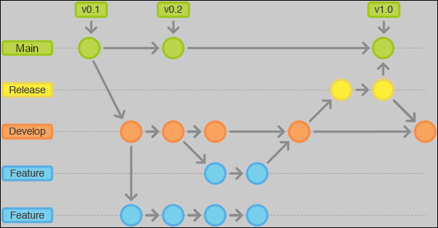
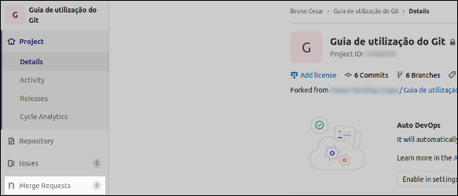
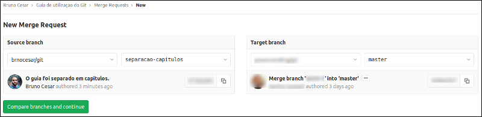

# Capítulo 4 - Trabalhando em equipe

1. [Trabalhando com _branches_](#1-trabalhando-com-_branches_)  
2. [Mesclando os ramos](#2-mesclando-os-ramos)  
3. [Limpando os _logs_ com _rebase_](#3-limpando-os-_logs_-com-_rebase_)  
4. [Resolvendo conflitos](#4-resolvendo-conflitos)  
5. [Deletando _branchs_](#5-Deletando-_branchs_)  

## 1 Trabalhando com _branches_

As _branches_ são ramos que permitem que o desenvolvimento do projeto ocorra em "linhas" independentes. Dessa forma é possível ter várias funcionalidades sendo desenvolvidas simultanêamente sem que uma afete a outra. Abaixo temos uma representação básica da organização de _branches_ em um repositório:

<figure>
	
	<figcaption>Figura 1 - Esquema de organização das branches.</figcaption>
</figure>

Logo quando fazemos o primeiro _commit_ em um repositório percebemos que é o nome da _branch_ é definido `main` ou `master`. Por conveção esses nomes são utilizados nas _branchs_ que mantém o código de produção. 

O desenvolvimento de novas funcionalidades ou correções é feito em _branchs_ específicas que são criadas a partir da `develop`. A `develop`, em geral, é a _branch_ que mantém o código mais atualizado e estável.

O site [Visualizing Git](https://git-school.github.io/visualizing-git/) é um _sandbox_ de repositório Git que possui representação gráfica dos comandos que são executados.

## 1.1 Criando uma _branch_ de trabalho

O comando `git branch` lista todas as _branches_ existentes no repositório local, indicando a _branch_ atual com um `*`. Para visualizar as _branchs_ remotas adicione o parâmetro `-a`.

```sh
$ git branch 
  ajustes1 # não é um bom nome
  ajustes2 # não é um bom nome
  ajustesN # não é um bom nome
  bug-fix-product-selection
* develop
  main
  set-employers-route
```

Ao iniciar o desenvolvimento de alguma alteração no projeto a primeira coisa a ser feita é se certificar que seu local está atualizado, e então, a partir disso criar uma _branch_ exclusiva para a essa tarefa. 

Uma "regra" quando se está trabalhando com várias pessoas em um projeto versionado é que você não deve inserir modificações diretamente nas _branches_ `develop` (desenvolvimento) e `main` (produção). O ideal é que seja definido um fluxo para que as alterações sejam incorporadas no código de produção, e que esse fluxo seja respeitado. Podemos entender esse fluxo como o "_git workflow_".

O caminho mais básico para esse fluxo começa por criar uma nova _branch_ a partir da `develop` para inserir suas modificações, que pode ser feito através de alguns comandos:

```sh
git branch nova-branch # cria uma branch chamada 'nova-branch' caso ela não exista
git checkout nova-branch # muda para a branch 'nova-branch' caso ela exista
git checkout -b nova-branch # cria a branch 'nova-branch' se não existe e muda para ela
```

Procure sempre nomear as _branches_ de forma significativa e começando com o número da tarefa/_issue_ (principalmente no GitLab).

## 2 Mesclando os ramos

Após finalizar o desenvolvimento em um dos ramos é necessário mesclá-lo a um dos ramos principais. Isso é feito com o comando abaixo a partir da _branch_ que vai "receber" as alterações:

```sh
git merge <branch>
```

Por exemplo, ao finalizar a correção do bug de seleção de produtos na _branch_ `bug-fix-product-selection` devemos mudar para a _branch_ `develop` e a partir dela "puxar" as alterações que serão mescladas:

```sh
(bug-fix-product-selection) $ git checkout develop
Switched to branch 'develop'
(develop) $ git merge bug-fix-product-selection
```

e ao realizar essa ação é gerado um _commit_ de _merge_ para marcar o ponto em que os ramos foram mesclados.

## 3 Limpando os _logs_ com _rebase_

Sempre que é feito um _merge_ em alguma _branch_ é gerado um _commit_ para marcar esse evento e com o tempo isso pode poluir o histórico de _logs_. 

Podemos usar o _rebase_ para "incorporar" os _commits_ de uma outra _branch_ sem manter os "_checkpoints_" de _merge_.

```sh
git rebase <branch>
```

## 4 Resolvendo conflitos

Abra a IDE e faça por lá.

## 5 Deletando _branchs_

Uma vez que o desenvolvimento em uma _branch_ foi finalizado e suas alterações já foram incorporadas em outro ramo, não há mais necessidade de matê-la. O comandos para deletar _branchs_ são:

```sh
git branch -d branch-local # deleta uma branch local
git push origin --delete branch-remote # deleta uma branch remota
```

---

daqui para baixo não está revisado

### 4.4. Requisição para incorporar suas modificações à versão estável do código<a name='secao4.4'></a>

Agora você deve fazer uma requisição para que suas alterações sejam incorporadas à versão estável do código. Clique em "Merge Requests" na barra lateral (Fig. 2) e na página que abrir clique em "New merge request". Você será direcionado para uma página em que deverá definir as _branches_ a serem comparadas (Fig. 3), após isso clique em "Compare branches and continue".

<figure>
	
	<figcaption>Figura 2</figcaption>
</figure>

<figure>
	
	<figcaption>Figura 3</figcaption>
</figure>

O procedimento vai mudar um pouco dependendo do _GitWorkflow_ que você está seguindo. Se você está trabalhando no _fork_ realizado para sua conta, você deve acessar a página "_Merge Requests_" a partir do **seu** repositório (na sua conta).

Note que a _branch_ comparada é a _master_ apenas porque este é um exemplo, em geral suas alterações serão incorporadas na _develop_, **NUNCA** na _master_.

Na página seguinte verifique as _branches_ de origem e destino. Se julgar necessário escreva um título, uma descrição sucinta e/ou defina alguém para ser notificado sobre o _Merge request_ e por fim clique em "_Submit merge request_".

### 4.5. Avaliando _Merge requests_<a name='secao4.5'></a>
