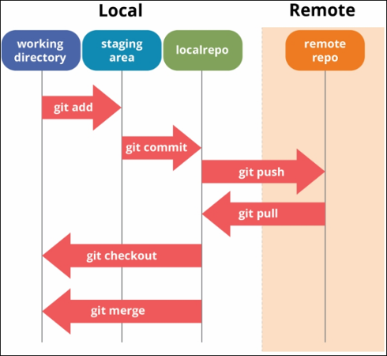

# 4. Fazendo alterações em um repositório<a name='cap4'></a>

### <a href='#secao4.1'>4.1. Criando uma _branch_ de trabalho</a>
### <a href='#secao4.2'>4.2. Realizando suas alterações</a>
### <a href='#secao4.3'>4.3. Subindo suas alterações</a>
### <a href='#secao4.4'>4.4. Fazendo a requisição para incorporar suas modificações à versão estável do código</a>
### <a href='#secao4.5'>4.5. Avaliando _Merge requests_</a>

## 4.1. Criando uma _branch_ de trabalho<a name='secao4.1'></a>
Após atualizar o repositório local, a primeira coisa a ser feita antes de começar a trabalhar em suas contribuições é criar uma nova _branch_, dedica a esta tarefa. **NUNCA** insira modificações diretamente na `develop` (desenvolvimento) e muito menos na `master` (_production_).

O procedimento ideal é criar uma branch a partir da develop (depois que ela estiver atualizada) para inserir suas modificações. Isso pode ser feito através dos passos descritos abaixo:

```sh
$ git branch 
* master
$ git checkout -b alteracoes
Switched to a new branch 'alteracoes'
$ git branch 
* alteracoes
  master
```

O comando `$ git branch` lista todas as _branches_ existentes no repositório local. Note que a saída do comando apresenta um `*` ao lado da _branch_ em que você está.

`$ git checkout -b <nome da nova branch>` cria uma _branch_ e muda para ela. Caso você queira mudar para uma _branch_ que já existe, basta retirar o modificador `-b`.

Procure nomear suas _branches_ de forma significativa, por exemplo: usando o número da tarefa ou algum nome relacionado a esta. No bloco abaixo temos alguns exemplos de nomes ruins para branchs e outros adequados:

```sh
$ git branch 
  ajustes
  ajustes1
  ajustes2
  ajustes3
  ajustes4
  ajustesn
  bug-fix-fingerprint
* develop
  master
  set-employers-route
```

## 4.2. Realizando suas alterações<a name='secao4.2'></a>
Agora que já existe uma branch de trabalho, as modificações no código podem começar a ser feitas.

Se durante o trabalho nessa _branch_ ocorrer a necessidade mudar para outra, utilize o comando `$ git stash` que irá jogar as alterações da área de seleção para uma pilha de modificações inacabadas. Para recuperar estas alterções e apaga-las da pilha utilize `$ git stash pop`.

```sh
$ git status 
On branch alteracoes
Changes not staged for commit:
  (use "git add <file>..." to update what will be committed)
  (use "git checkout -- <file>..." to discard changes in working directory)

	modified:   README.md

no changes added to commit (use "git add" and/or "git commit -a")
$ git stash
Saved working directory and index state WIP on alteracoes: 0f08023 Merge branch 'master' into 'master'
$ git checkout master 
Switched to branch 'master'
Your branch is ahead of 'origin/master' by 1 commit.
  (use "git push" to publish your local commits)
$ git status 
On branch master
Your branch is ahead of 'origin/master' by 1 commit.
  (use "git push" to publish your local commits)

nothing to commit, working tree clean
$ git checkout alteracoes 
Switched to branch 'alteracoes'
$ git stash pop
On branch alteracoes
Changes not staged for commit:
  (use "git add <file>..." to update what will be committed)
  (use "git checkout -- <file>..." to discard changes in working directory)

	modified:   README.md

no changes added to commit (use "git add" and/or "git commit -a")
Dropped refs/stash@{0} (5c65ecbca7a64aa3724b17afbb509ffde4429462)
```

## 4.3. Subindo as alterações para o repositório remoto<a name='secao4.3'></a>
Quando as alterações estiverem completas é o momento de subi-las para o repositório remoto. Na imagem abaixo podemos ver o "caminho" que as alterações seguem até que estejam de fato no seu repositório remoto e no bloco que segue temos os comandos referentes a cada etapa.

<figure>
	
	<figcaption>Figura 1 - Fluxo das alterações no seu repositório Git.</figcaption>
</figure>


```sh
$ git status 
On branch alteracoes
Changes not staged for commit:
  (use "git add <file>..." to update what will be committed)
  (use "git checkout -- <file>..." to discard changes in working directory)

	modified:   README.md

Untracked files:
  (use "git add <file>..." to include in what will be committed)

	imagens/0-intro.png
	imagens/5-git_flow.png
	imagens/6-git_flow.png

no changes added to commit (use "git add" and/or "git commit -a")
$ git add .
$ git status 
On branch alteracoes
Changes to be committed:
  (use "git reset HEAD <file>..." to unstage)

	modified:   README.md
	new file:   imagens/0-intro.png
	new file:   imagens/5-git_flow.png
	new file:   imagens/6-git_flow.png

$ git commit -m "Alterações nas imagens, criação de um índice com links internos e adição de conteúdo ao manual."
[alteracoes 1edaf1c] Alterações nas imagens, criação de um índice com links internos e adição de conteúdo ao manual.
 4 files changed, 104 insertions(+), 19 deletions(-)
 create mode 100644 imagens/0-intro.png
 create mode 100644 imagens/5-git_flow.png
 create mode 100644 imagens/6-git_flow.png
$ git status 
On branch alteracoes
nothing to commit, working tree clean
$ git push origin alteracoes 
Counting objects: 8, done.
Delta compression using up to 4 threads.
Compressing objects: 100% (8/8), done.
Writing objects: 100% (8/8), 394.19 KiB | 14.30 MiB/s, done.
Total 8 (delta 1), reused 0 (delta 0)
remote: 
remote: To create a merge request for alteracoes, visit:
remote:   https://gitlab.com/brnocesar/git/merge_requests/new?merge_request%5Bsource_branch%5D=alteracoes
remote: 
To gitlab.com:brnocesar/git.git
 * [new branch]      alteracoes -> alteracoes
```

1. `$ git status`

Este comando nos permite ver as alterações que serão inseridos no commit. Arquivos "rastreasdos" são os que já existem no repositório e estão sendo **modificados**, enquanto que os "não rastreados" estão sendo criados.

2. `$ git add .`

Com este comando adicionamos **todas** as alterações para _stage_.

3. `$ git commit -m "Mensagem de commit."`

Precisamos "commitar" as alterações para incorporá-las ao repositório local. A mensagem de _commit_ é obrigatória e não pode ser uma string vazia. Procure escrever uma mensagem que reflita suas alterações da forma mais clara e enxuta possível.

4. `$ git push <nome do remote> <nome da branch>`

Para incorporar essas alterações ao seu repositório remoto é necessário dar o _push_, neste comando você deve especificar o nome do seu _remote_ e da _branch_ (note que eles são separados por um espaço e não "/").

**obs. 1):** Você pode adicionar e commitar arquivos individualmente. Para isso, basta especificar o(s) arquivos no comando **(2)** e commitar.

**obs. 2):** Você pode usar o comando `$ git log` para visualizar o histórico de _commits_ do repositório.

### 4.4. Requisição para incorporar suas modificações à versão estável do código<a name='secao4.4'></a>

Agora você deve fazer uma requisição para que suas alterações sejam incorporadas à versão estável do código. Clique em "Merge Requests" na barra lateral (Fig. 2) e na página que abrir clique em "New merge request". Você será direcionado para uma página em que deverá definir as _branches_ a serem comparadas (Fig. 3), após isso clique em "Compare branches and continue".

<figure>
	
	<figcaption>Figura 2</figcaption>
</figure>

<figure>
	
	<figcaption>Figura 3</figcaption>
</figure>

O procedimento vai mudar um pouco dependendo do _GitWorkflow_ que você está seguindo. Se você está trabalhando no _fork_ realizado para sua conta, você deve acessar a página "_Merge Requests_" a partir do **seu** repositório (na sua conta).

Note que a _branch_ comparada é a _master_ apenas porque este é um exemplo, em geral suas alterações serão incorporadas na _develop_, **NUNCA** na _master_.

Na página seguinte verifique as _branches_ de origem e destino. Se julgar necessário escreva um título, uma descrição sucinta e/ou defina alguém para ser notificado sobre o _Merge request_ e por fim clique em "_Submit merge request_".

### 4.5. Avaliando _Merge requests_<a name='secao4.5'></a>
