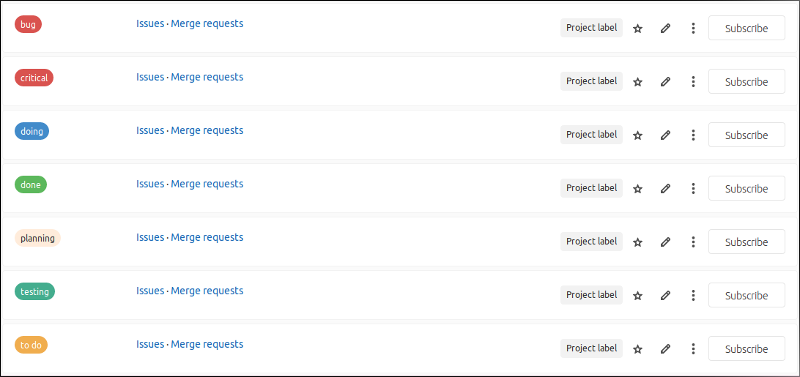
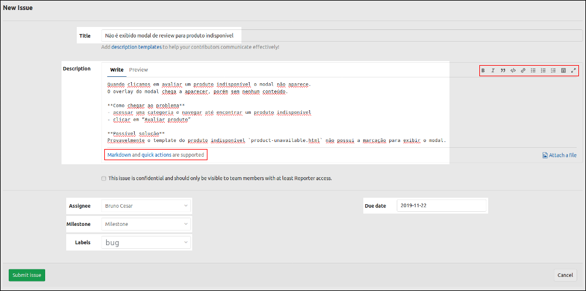
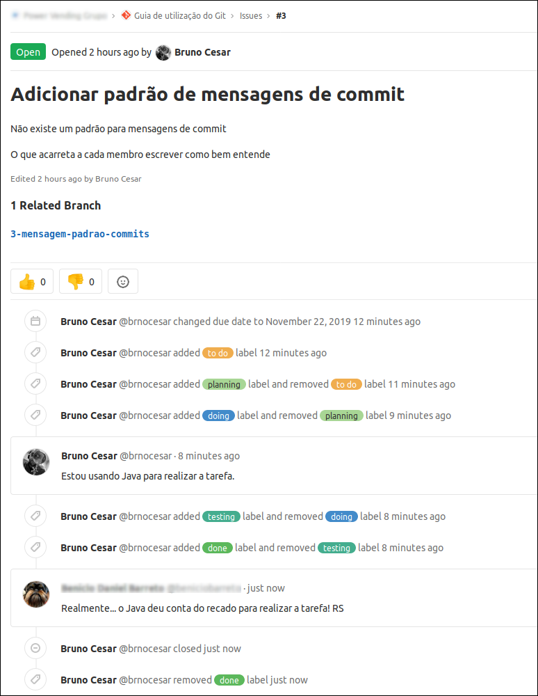
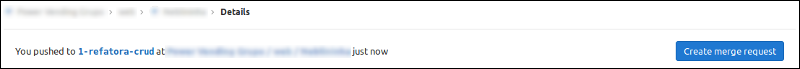

# 5. _Issues_<a name='cap5'></a>

As _issues_ de um projeto são as tarefas pontuais e devem ser pensadas como tal, por exemplo: criar um CRUD de **Batatinha** e refatorar a classe de **Beterraba** são tarefas separadas e não devem estar na mesma _issue_, indo além, dependendo da complexidade da classe **Batatinha** cada método pode pode ser uma _issue_.

A área das _issues_ pode ser acessada na barra lateral esquerda em cada projeto (repositório). Lá podemos acessar cada uma das páginas das _issues_: _list_, _board_, _labels_ e _milestones_.
- `list`: permite acessar todas as _issues_ do projeto, filtrando entre as abertas e fechadas;
- `board`: podemos acompanhar o progresso de cada _issue_ de acordo com os _labels_ definidos;
- `labels`: temos acesso a todos os _labels_ do projeto, podendo editá-los, deletar e criar novos.

#### <a href='#secao5.1'>5.1. Definindo os _labels_</a>
#### <a href='#secao5.2'>5.2. Criando uma _issue_</a>
#### <a href='#secao5.3'>5.3. Executando uma _issue_</a>
#### <a href='#secao5.4'>5.4. Testando o que foi implementado</a>

<br>

## 5.1. Definindo os _labels<a name='secao5.1'></a>
Antes de começar a criar _issues_ o ideal é pensar em como as _issues_ serão "traqueadas" ao longo do projeto, e isso é feito por meio dos _labels_. Os _labels_ nada mais são que representações dos possíveis estados que uma tarefa pode assumir no projeto.

Ao acessar a página dos _labels_ você pode começar criando cada _label_ em específico ou gerar um conjunto padrão e ir alterando conforme as necessidades do projeto. Na Fig. 1 podemos ver alguns _labels_ bastante comuns.

<figure>
	
	<figcaption>Figura 1 - Labels "genéricos" para um projeto.</figcaption>
</figure>

## 5.2. Criando uma _issue_<a name='secao5.2'></a>
Já sabemos que as _issues_ são as tarefas que serão atribuídas aos membros da equipe durante o desenvolvimento do projeto e agora que ja foram definidos os _labels_ do projeto podemos começar a criar as _issues_. Para isso vá até a página `list` e clique no botão _New Issue_, localizado na parte superior direita.

Você deve escrever um **título**, a **descrição**, **atribuir** a algum membro e definir o **_label_** da tarefa (Fig. 2). Precisamos ver algumas boas maneiras para se escrever uma boa _issue_. 

Essa etapa é **muito** importante pois fornece maior autonomia ao desenvolvedor e evita retrabalho. Uma boa _issue_ deve dizer:

- o que deve ser feito;
- como deve ser feito (*);
- qual o resultado buscado;

A parte do 'como deve ser feita' é muito subjetiva e não se trata do passo a passo de como implementar, mas DEVE ter a regra de negócio. Essa parte também pode conter alguma dica, desde que não seja algo que "engesse" o desenvolvimento por parte do responsável pela _issue_.

Abaixo temos o exemplo de uma _issue_ ruim e na Fig. 2 como esta mesma _issue_ pode ser melhor escrita:

> **Título da issue**: Modal de review para produto indisponível
> 
> **Descrição**: Transpilar o modal de review para os produtos indisponíveis da mesma forma que acontece para produtos disponíveis.

<figure>
	
	<figcaption>Figura 2 - Exemplo de criação de uma boa issue.</figcaption>
</figure>

**Lembre-se** que você deve escrever as _issues_ pensando na equipe e não em você. Além disso o campo para descrição aceita _markdown_, então use quando achar necessário.

## 5.3. Executando uma _issue_<a name='secao5.3'></a>
Agora que as _issues_ do projesto foram criadas é o momento de iniciar o desenvolvimento. Existem alguns passos que o membro a que a _issue_ for atriduída deverá seguir. A depender do projeto o fluxo de trabalho pode variar, mas em geral não vai fugir do que é descrito abaixo. 

1. **criar uma _branch_ específica para realizar a tarefa**

O nome da _branch_ deve seguir o padrão `<id da issue>-<nome que remeta à tarefa e mantenha o bom senso>`: iniciar com o `#id` da tarefa (sem #) e um traço (-) separando-o do nome escolhido (lembrando que nomes de _branches_ não podem ter espaços em branco). Abaixo temos alguns exemplos que devem ser seguidos:
```sh
3-layout-pagina-inicial
7-crud-produtos
22-views-cargos
```

2. **Atualizar o _label_ da tarefa conforme necessário**

Para cada nova etapa que for iniciada (desde que seja contemplada por alguma _label_) é necessário atualizar o estado da tarefa. Basta seguir a ordem do `board`:

`To Do` -> `Planning` -> `Doing` -> `Testing` -> `Merge Request`.

###### IMPORTANTE: No momento em que este guia está sendo escrito a sequência e os rótulos acima representam o Git Workflow padrão da PV, porém isso pode ser alterado e o guia não ser atualizado.

Na Fig. 3 é apresentada a "linha do tempo" da tarefa com todas as mudanças de estado e comentários, note ainda que a(s) devida _branch_ fica relacionada na página da _issue_.

<figure>
	
	<figcaption>Figura 3 - Registro de ações na issue. </figcaption>
</figure>

## 5.4. Testando o que foi implementado<a name='secao5.4'></a>
Após terminar de codificar sua tarefa você deve testá-la. Em um cenário ideal, ao longo da etapa de codificação os testes básicos já foram realizados.

Na etapa de `testing` vamos testar o que foi implementado com a versão mais recente do código de desenvolvimento, e não com a versão de quando você criou a branch da _issue_. Isso deve ser feito para garantir que sua implementação não vai quebrar nada ao ser incorporada. Então, vocẽ deve executar os seguintes passos:

1. Vá para a _branch_ _develop_ e atualize-a em relação ao repositório remoto:

```sh
$ git checkout develop
$ git pull origin develop
```

2. Volte para a _branch_ da tarefa e incorpore as novas alterações da _branch_ _develop_:
```sh
$ git checkout 3-mensagem-padrao-commits
$ git merge develop
```

Após finalizar os testes com a versão mais atual do código, executar as devidas correções (se necessário) e se certificar de que o que foi implementado faz o que é pedido na _issue_, a tarefa pode mudar para o estado `Merge Request` e o _merge request_ para a _develop_ pode ser feito. O procedimento de _MR_ ja foi abordado no [capítulo anterior](https://gitlab.com/powervending/git/tree/master/cap4%20-%20Fazendo%20altera%C3%A7%C3%B5es#secao4.4).

<figure>
	
	<figcaption>Figura 4 - Repositório "sugere" a ação de fazer o Merge Request. </figcaption>
</figure>

Após o _merge request_ ser aceito a _issue_ é automáticamente fechada.
